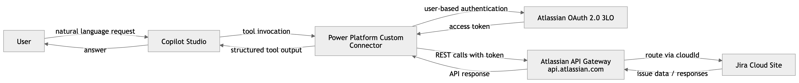
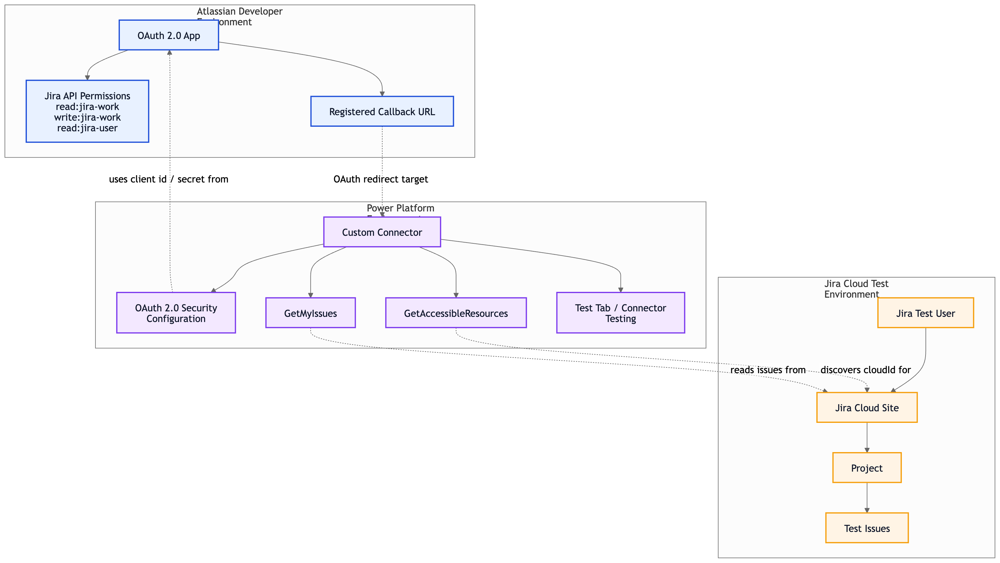
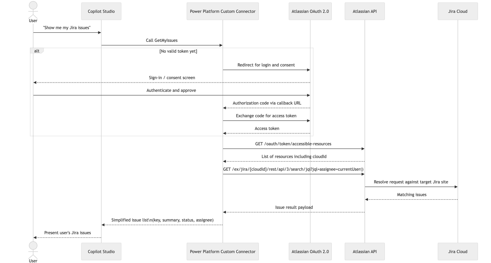

# Secure Jira Integration in Copilot Studio Using a Custom Connector and OAuth 2.0 3LO

One of the strongest internal use cases for Microsoft Copilot Studio is employee self-service around IT support processes. Instead of asking employees to open Jira, navigate through project views, remember ticket numbers, or contact the help desk for routine status questions, an internal agent can answer those questions directly in the flow of work.

In that model, the employee can ask things like: "What is the status of my laptop request?", "Show me my open IT tickets", "Summarize what changed on my access request", or "Create a new issue for this VPN problem." The experience is faster, more natural, and much closer to how users actually want to interact with internal support services.

That is the real benefit of connecting Jira to Copilot Studio: the agent becomes a self-service layer on top of the existing IT support process, while Jira remains the system of record underneath. Employees get quicker answers and less tool-switching, while support teams reduce repetitive status requests and manual triage conversations.

To make that work well in real customer environments, the integration usually cannot stay generic for long. A standard Jira connector can work for a quick prototype, but it often becomes limiting once Jira is customized with custom fields, project-specific required attributes, and tailored workflows.

A custom connector is a better fit because it lets you model the Jira REST API around the customer’s actual data model instead of forcing the agent into a generic integration shape. Microsoft positions custom connectors exactly for this kind of REST-based integration work.[1]

The second design choice is authentication. A shared service account is operationally convenient, but it weakens least-privilege and auditability because every user effectively acts through the same identity. Atlassian OAuth 2.0 three-legged OAuth (3LO) is the cleaner design for internal self-service agents because the app accesses Jira on behalf of the signed-in user.[2] That means the agent only sees what the employee is already allowed to see in Jira.

This repository contains:

- A practical getting-started guide in this `README.md`
- An initial Swagger / OpenAPI sample configuration at [`openapi/jira-cloud-custom-connector.swagger.yaml`](./openapi/jira-cloud-custom-connector.swagger.yaml)

## Why the Standard Connector Is Often Not Enough

The standard Jira connector is useful for basic scenarios, but it is often not flexible enough once tenant-specific requirements matter. In practice, the gaps usually show up in three places:

- custom fields
- precise control over returned fields
- project-specific or tenant-specific API behavior

With a custom connector, you define only the operations the agent really needs, including paths, parameters, default values, and visibility behavior. This matters when the agent should return exactly the Jira data that is relevant in the business context, not just any available issue payload.[1]

## Target Architecture

The target architecture has four building blocks:

1. An OAuth 2.0 app in the Atlassian Developer Console
2. A custom connector in Power Platform
3. A Copilot Studio agent that uses the connector as a tool
4. A user sign-in flow with 3LO so each user brings their own Jira permissions

This produces an internally publishable agent for Teams or Microsoft 365 Copilot that accesses Jira securely in the context of the signed-in user.[6][7]



## Prerequisites

You need:

- a Jira Cloud site with test data
- access to the Atlassian Developer Console
- a Power Platform environment
- a Copilot Studio agent that will use the custom connector as a tool
- permissions to publish and share both the agent and the connector

If you plan to publish into Teams or Microsoft 365 Copilot, complete those publication and sharing steps separately in Copilot Studio and Microsoft 365.[6][7][13]

## Step 1: Create an OAuth 2.0 App in Atlassian

Create a new OAuth 2.0 integration in the Atlassian Developer Console. This app supplies the `Client ID` and `Client Secret` that you later enter in the custom connector security settings.[2]

For an initial test, these scopes are usually enough:

```text
read:jira-work read:jira-user write:jira-work offline_access
```

Two details matter here:

- Atlassian scopes use `:` and not `.`
- `offline_access` is required if you want a refresh token for background renewal[2]

Atlassian explicitly documents that adding `offline_access` to the authorization request is what enables refresh token issuance in the initial OAuth flow.[2]

One practical detail trips teams up regularly: the Power Platform redirect URL does not exist yet at this stage. It is generated only after the custom connector is created and saved. Microsoft now uses a per-connector redirect URI for OAuth 2.0 custom connectors, so you must copy that generated redirect URL back into the Atlassian app configuration after the connector is saved.[1]

## What 3LO Means

3LO stands for three-legged OAuth. In this model, the user signs in, consents to the app, and the app can then call Jira APIs within the scope of that user’s permissions.[2] For internal agents, that is the correct security model because the agent acts as a user-facing layer over existing Jira authorization instead of bypassing it with a shared technical account.

## Step 2: Create the Custom Connector in Power Platform

In Power Platform, create a new connector under **Custom connectors** and choose **Create from blank**.[9]

Use this base configuration:

- Scheme: `HTTPS`
- Host: `api.atlassian.com`
- Base URL: `/`

This follows Atlassian’s 3LO request pattern, where Jira calls are made via `api.atlassian.com` and the Jira-specific route is built as `/ex/jira/{cloudId}/{api}`.[2]

In the **Security** tab, configure:

- Authentication type: `OAuth 2.0`
- Identity provider: `Generic OAuth 2.0`
- Authorization URL: `https://auth.atlassian.com/authorize`
- Token URL: `https://auth.atlassian.com/oauth/token`
- Refresh URL: `https://auth.atlassian.com/oauth/token`

Scopes are entered as a space-separated string:

```text
read:jira-work read:jira-user write:jira-work offline_access
```

## Step 3: Add the Redirect URL

Save the connector once so Power Platform generates its unique redirect URL.[1] Then copy that redirect URL back into the Atlassian Developer Console. Until that is done, the OAuth flow will not complete successfully.



## Step 4: Model the Jira Operations in the Connector

The real value of the custom connector comes from its actions. For this scenario, three operations are enough for a strong starting point:

1. discover accessible Jira resources
2. read issues
3. optionally create issues

The bundled example definition is here:

- [Swagger / OpenAPI example](./openapi/jira-cloud-custom-connector.swagger.yaml)

### 4.1 Accessible Resources

Start with:

```text
GET /oauth/token/accessible-resources
```

Atlassian documents this endpoint as the way to discover which cloud resources the signed-in user authorized for the app. The response includes the site `id`, which becomes your Jira `cloudId` for later calls.[2]

### 4.2 Reading Jira Issues

Use a Jira path under:

```text
/ex/jira/{cloudId}/rest/api/3/...
```

Atlassian documents this exact pattern for 3LO calls and notes that requests go through `api.atlassian.com`, not the site-specific `*.atlassian.net` hostname.[2]

For issue search, the example connector uses:

```text
GET /ex/jira/{cloudId}/rest/api/3/search/jql
```

JQL is the key query mechanism for narrowing results.[3][4] A useful default is:

```text
assignee = currentUser()
```

That returns only issues assigned to the signed-in user, which is a strong default for an internal personal productivity agent.

A practical default for returned fields is:

```text
summary,status,assignee,priority,created,updated
```

This is one of the biggest advantages of the custom connector approach: you can deliberately expand the field set to include customer-specific custom fields instead of being limited to a generic payload.

### 4.3 Creating Issues

Optionally, add:

```text
POST /ex/jira/{cloudId}/rest/api/3/issue
```

For a first test, a minimal request body like this is often enough:

```json
{
  "fields": {
    "project": { "key": "DEMO" },
    "summary": "Created from Copilot Studio",
    "issuetype": { "name": "Task" }
  }
}
```

In real Jira projects, required fields often go beyond this. The exact payload depends on project configuration, issue type, and any custom validation rules.

## The Role of JQL in This Architecture

JQL is essential because it filters the result set before the model sees it. That improves relevance, reduces noise, and keeps the agent from ingesting unnecessary ticket context.[3][4]

Good examples include:

- `assignee = currentUser()`
- `project = ABC AND assignee = currentUser()`
- `assignee = currentUser() AND statusCategory != Done`

## Designing Visibility and Parameters Correctly

For custom connectors, `x-ms-visibility` is important on operations, parameters, and response properties. Microsoft documents three main values:[5][10]

- `important`
- `advanced`
- `internal`

The documented behavior is:

- `important` is shown first
- `advanced` is hidden behind advanced options
- `internal` is not shown in the UI[5][10]

Microsoft also documents an important constraint: if a parameter is both `internal` and `required`, it must have a default value.[10]

For this Jira scenario, a practical mapping is:

- operation summaries like `Get my Jira issues` and `Create Jira issue`: `important`
- `jql`: `important`
- `fields`: `advanced`
- `cloudId`: ideally `internal`, or at least `advanced`

In production, `cloudId` is usually a stable technical value and should not be left to the end user unless there is a real multi-site requirement.

## The Swagger Definition as a Practical Example

The bundled Swagger definition includes the three core actions:

- `GetAccessibleResources`
- `GetMyIssues`
- `CreateIssue`

It is intentionally close to how many teams start in practice: technically focused, minimal, and ready to import into a Power Platform custom connector. Over time, you will usually refine it with stronger response schemas, more precise descriptions, and cleaner internal parameter handling.[5][10]

## Step 5: Test the Connector

In the connector’s **Test** tab, create an initial connection and validate both authentication and the defined operations.

A good first check is `GetAccessibleResources` because it confirms two things immediately:

- the OAuth flow works
- a valid `cloudId` is returned

Once you have that `cloudId`, use it in the issue search action. If the expected issue data appears, the connector is technically working.

## Step 6: Use the Connector as a Tool in Copilot Studio

Add the custom connector to your Copilot Studio agent as a tool.[11][12]

The most important design principle here is not to leave stable technical inputs entirely to the model. Copilot Studio lets you override an input with **Fill using -> Custom value**, which prevents the agent from asking the user for that value.[11]

That is the right place to prefill values such as:

- `cloudId`
- a default `fields` list
- a business-safe default JQL like `assignee = currentUser()`

Also give each action a clear description so the orchestrator can decide more reliably when the tool should be used.[11]

## Step 7: Publish the Agent and Make It Available

After the agent is configured, publish it and connect it to the **Teams and Microsoft 365 Copilot** channels if needed.[6][7]

Microsoft documents that after publication you can:

- add the Teams and Microsoft 365 Copilot channel
- share an installation link
- expose the agent to shared users
- submit it for broader organizational distribution via admin approval[6][7]

## Step 8: Share the Custom Connector

Publishing the agent is not enough. The custom connector must also be shared separately, otherwise other users will not actually be able to use it.[1][8]

This distinction matters a lot in Copilot Studio projects:

- the agent must be shared or published to the target users
- the connector must also be shared with those same users or groups

Only then does the end-to-end scenario work.

## What the User Experiences the First Time

On first use, the user typically sees a prompt to create a connection for the custom connector. After selecting it, the user is redirected to Atlassian, signs in, and grants consent. Once complete, the connector can call Jira on that user’s behalf.[2][11][12]

Because `offline_access` is included, the connection can later renew tokens in the background through the refresh-token flow instead of forcing repeated full sign-ins.[2]



## Why This Approach Is More Secure Than a Service Account

The main architectural advantage is the security model. A service account centralizes all agent activity behind one technical identity. That may be simpler to operate, but it weakens least-privilege and traceability.

With 3LO:

- each user acts with their own Jira permissions
- the agent respects existing Jira authorization boundaries
- visibility is naturally limited to what the signed-in user can already access

For internal enterprise scenarios, that is usually the stronger design.

## Conclusion

If an internal Copilot Studio agent needs access to Jira, a custom connector with Generic OAuth 2.0 and Atlassian 3LO is a strong implementation pattern. It gives you precise control over Jira operations, supports customer-specific fields, and keeps access in the security context of the individual user.

Combined with a fixed `cloudId`, curated `fields`, business-focused JQL defaults, and correct sharing of both the agent and the connector, the result is a solution that is both flexible and security-aligned.

## Helpful Official Documentation

### Microsoft

- [Custom connectors overview][1]
- [Create a custom connector from scratch][9]
- [Create a custom connector with an OpenAPI extension][10]
- [Learn best practices for string fields][5]
- [Share a custom connector in your organization][8]
- [Add tools to custom agents][11]
- [Use connectors in Copilot Studio agents][12]
- [Share agents with other users][13]
- [Connect and configure an agent for Teams and Microsoft 365][6]
- [Publish Agents for Microsoft 365 Copilot][7]

### Atlassian

- [OAuth 2.0 (3LO) apps][2]
- [Use advanced search with Jira Query Language (JQL)][3]
- [The Jira Cloud platform REST API][4]

[1]: https://learn.microsoft.com/en-us/connectors/custom-connectors/ "Custom connectors overview"
[2]: https://developer.atlassian.com/cloud/jira/software/oauth-2-3lo-apps/ "OAuth 2.0 (3LO) apps"
[3]: https://support.atlassian.com/jira-service-management-cloud/docs/use-advanced-search-with-jira-query-language-jql/ "Use advanced search with Jira Query Language (JQL)"
[4]: https://developer.atlassian.com/cloud/jira/platform/rest/v3/api-group-issue-search/ "The Jira Cloud platform REST API"
[5]: https://learn.microsoft.com/en-us/connectors/custom-connectors/connector-string-guidance "Learn best practices for string fields"
[6]: https://learn.microsoft.com/en-us/microsoft-copilot-studio/publication-add-bot-to-microsoft-teams "Connect and configure an agent for Teams and Microsoft 365"
[7]: https://learn.microsoft.com/en-us/microsoft-365-copilot/extensibility/publish "Publish Agents for Microsoft 365 Copilot"
[8]: https://learn.microsoft.com/en-us/connectors/custom-connectors/share "Share a custom connector in your organization"
[9]: https://learn.microsoft.com/en-us/connectors/custom-connectors/define-blank "Create a custom connector from scratch"
[10]: https://learn.microsoft.com/en-us/connectors/custom-connectors/openapi-extensions "Create a custom connector with an OpenAPI extension"
[11]: https://learn.microsoft.com/en-us/microsoft-copilot-studio/add-tools-custom-agent "Add tools to custom agents - Microsoft Copilot Studio"
[12]: https://learn.microsoft.com/en-us/microsoft-copilot-studio/advanced-connectors "Use connectors in Copilot Studio agents"
[13]: https://learn.microsoft.com/en-us/microsoft-copilot-studio/admin-share-bots "Share agents with other users - Microsoft Copilot Studio"

---

This guide was authored and validated by [Joris Kalz](https://www.linkedin.com/in/joris-kalz/) and [George Dimitrakos](https://www.linkedin.com/in/george-dimitrakos/).
